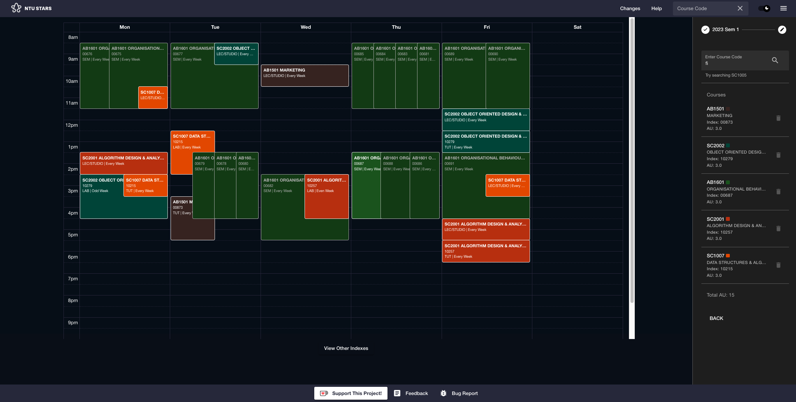
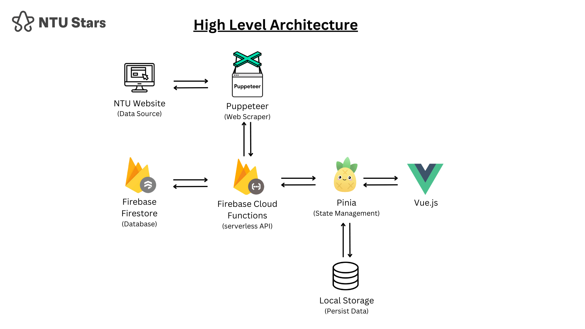

 

  
  <h3 align="center">NTUStars</h3>
  
  

    Solving a decade old problem in NTU!
     
    <a href="https://www.ntustars.com"><strong>View Website »</strong></a>
     
     
    <a href="https://www.linkedin.com/posts/lenson-lim-05974621b_during-the-semester-break-i-finally-attempted-activity-7100377614392950784-J8Md?utm_source=share&utm_medium=member_desktop">LinkedIn</a>
    ·
    <a href="https://github.com/Lebarnon/NTUStars-server">Server Repo</a>
    ·
    <a href="https://github.com/Lebarnon/NTUStars/issues">Report Bug</a>
    ·
    <a href="https://github.com/Lebarnon/NTUStars/issues">Request Feature</a>
  

#

# Background
Bring up the phrase "STARS Wars" to any NTU student and the response would be universal - frustration and anger. 
STARS refers to a course bidding system provided by NTU in which students engage in two major activities:
    - planning their upcoming semester timetable
    - bidding and securing their courses

I have discussed the background more in-depth on LinkedIn, so follow the link if you would like to find out more! [LinkedIn](https://www.linkedin.com/posts/lenson-lim-05974621b_during-the-semester-break-i-finally-attempted-activity-7100377614392950784-J8Md?utm_source=share&utm_medium=member_desktop)

In summary, this project aims to solve a decade-old problem by providing a tool for NTU students to plan their timetable in an effective and simplified manner.

# Architecture

Frontend Repository: [NTUStars App](https://github.com/Lebarnon/BetterNotesApp) 
Backend Repository: [NTUStars Server](https://github.com/Lebarnon/BetterNotesServer)

### **Frontend: Vue3 + Pinia**
For the frontend, I utilized Vue3 composition API and managed most of the application state using Pinia. If you are familiar with React, Pinia is similar to React Redux.
Most of the application logic lies within the three stores I have:
1. Schedules Store
   The schedules store's main job is to interact with my serverless APIs and format incoming data into a structure I want for my specific use cases in the frontend.
2. Timetable Store
   The timetable store contains all functionality related to the actual timetable itself, whether it's adding courses, removing, previewing, etc. In hindsight, I should have done this in Typescript, but refactoring at this point was a lot of work. Instead, I brought the lessons learned to this project:
   [BetterNotes](https://github.com/Lebarnon/BetterNotesApp)
3. Settings Store
   The settings store contains all the settings-related stuff in the app like dark mode.

### **Backend: Firebase**
Firebase Functions were used as my serverless server mainly due to its always free tier (great for my pocket).
This project could actually be done entirely on the frontend, but I really wanted to play around with a serverless architecture and to hide crucial "business logic".

The overall logic in Firebase Functions is as follows:

**User request for data**

Validate request --> Check Firestore for requested data --> If available, return data from Firestore --> Else start scraping service (see) --> clean & format scraped data --> save into Firestore --> return data

**Scraping Service**

[NTU Class Schedule](https://wish.wis.ntu.edu.sg/webexe/owa/aus_schedule.main) is where I get course timetable data.
[NTU Content of Courses](https://wis.ntu.edu.sg/webexe/owa/aus_subj_cont.main) is where I get data on course information like the course description.
Not sure why they must have separate websites for different information. So based on the request and using [Puppeteer](https://pptr.dev/), I first had to analyze the HTML structure of the website, find the appropriate information I want using a variety of CSS selectors, and finally return it to be formatted in whatever way I deemed fit to be saved in Firestore.

# Considerations
For anyone who might be curious, these are just some of my considerations and thought processes during this project.

## Identifying the Issue
Planning a timetable first requires students to add the modules they are interested in. Afterward, students would have to painstakingly iterate through each index for each module to find a timetable that is clash-free and to their preference (no lessons on a particular day, morning/afternoon lessons). Given that each module has dozens or even hundreds of indexes, a simple calculation shows that students have thousands of possible timetable combinations to go through before finding suitable ones. Thousands.

The most intuitive idea is to help generate all possible combinations, and students just need to select their ideal ones.

However, existing attempts to solve this problem already involve timetable generators, but through testing and feedback, they often fall short due to the complexity of personal preferences. To truly simplify the process, I recognized the need for flexibility without sacrificing simplicity.

## Developing the Solution
Here are the consolidated and summarized considerations:

**Current Solutions**: Existing attempts to solve this problem involve timetable generators, but they often fall short due to the complexity of personal preferences. To truly simplify the process, I recognized the need for flexibility without sacrificing simplicity.

**Value**: I was aware that my solution needed to be significantly better than current options that students are familiar with to be truly valuable. This meant optimizing load times, modernizing the user interface while maintaining familiarity, and significantly streamlining the planning process.

**Cost**: As this project would ultimately be intended for the community, cost-efficiency was essential. Therefore, there was a need to strike a balance between different cloud providers and their solutions that would allow me to scale the project comfortably.

**Requirements**: I used a simple litmus test, which was to constantly ask, "Would I use it?". Aside from that, there was also a need to continuously seek feedback and user testing from my peers as NTU students were, after all, the key stakeholders.

All in all, the result was NTUStars! The journey was definitely rewarding, and I've learned so much because I was able to take the time to understand what's going on, explore other possibilities, and simply test out any ideas I had.
